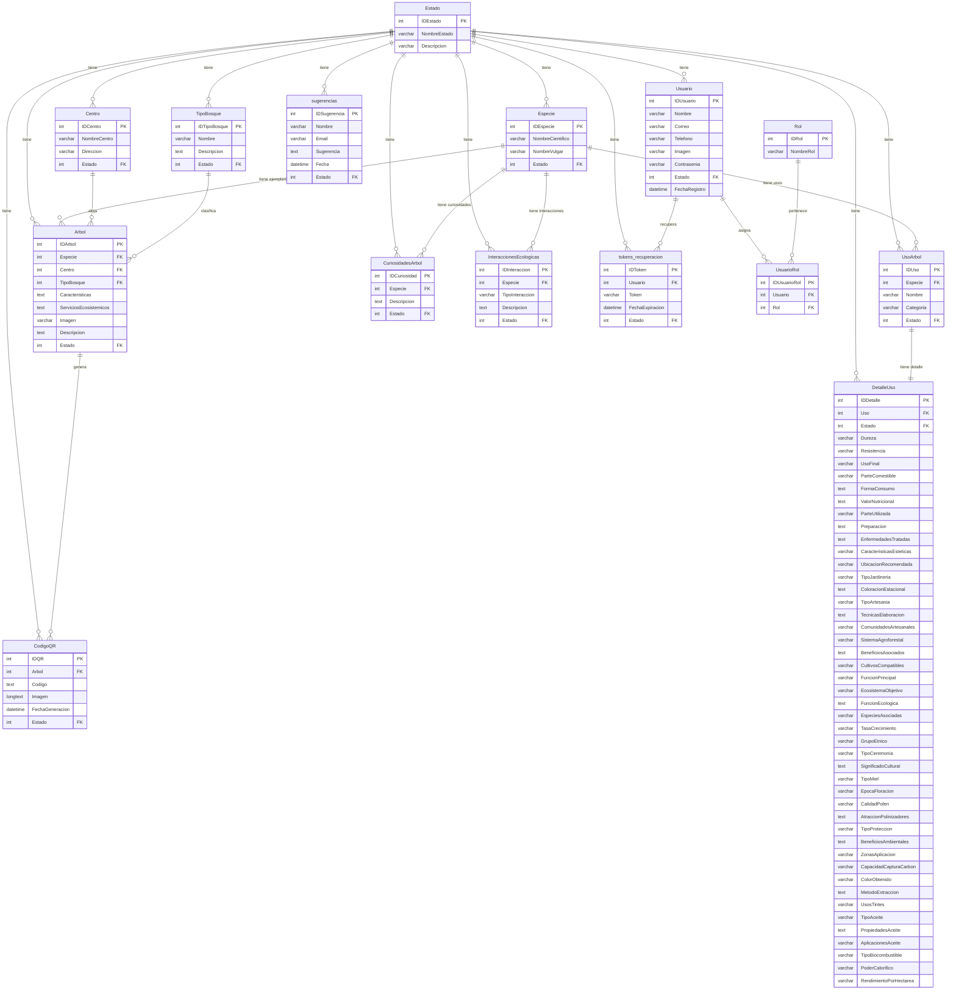

# Diagrama BD VerdeQR

```mermaid
erDiagram
    Estado ||--o{ Usuario : tiene
    Estado ||--o{ Especie : tiene
    Estado ||--o{ UsoArbol : tiene
    Estado ||--o{ DetalleUso : tiene
    Estado ||--o{ Arbol : tiene
    Estado ||--o{ CodigoQR : tiene
    Estado ||--o{ CuriosidadesArbol : tiene
    Estado ||--o{ InteraccionesEcologicas : tiene
    Estado ||--o{ TipoBosque : tiene
    Estado ||--o{ Centro : tiene
    Estado ||--o{ sugerencias : tiene
    Estado ||--o{ tokens_recuperacion : tiene

    Especie ||--o{ Arbol : "tiene ejemplares"
    Especie ||--o{ UsoArbol : "tiene usos"
    Especie ||--o{ CuriosidadesArbol : "tiene curiosidades"
    Especie ||--o{ InteraccionesEcologicas : "tiene interacciones"
    UsoArbol ||--|| DetalleUso : "tiene detalle"
    Centro ||--o{ Arbol : "aloja"
    TipoBosque ||--o{ Arbol : "clasifica"
    Arbol ||--o{ CodigoQR : "genera"

    Usuario ||--o{ UsuarioRol : "asigna"
    Rol ||--o{ UsuarioRol : "pertenece"
    Usuario ||--o{ tokens_recuperacion : "recupera"

    Estado {
        int IDEstado PK
        varchar NombreEstado
        varchar Descripcion
    }

    Especie {
        int IDEspecie PK
        varchar NombreCientifico
        varchar NombreVulgar
        int Estado FK
    }

    Arbol {
        int IDArbol PK
        int Especie FK
        int Centro FK
        int TipoBosque FK
        text Caracteristicas
        text ServiciosEcosistemicos
        varchar Imagen
        text Descripcion
        int Estado FK
    }

    UsoArbol {
        int IDUso PK
        int Especie FK
        varchar Nombre
        varchar Categoria
        int Estado FK
    }

    DetalleUso {
        int IDDetalle PK
        int Uso FK
        int Estado FK
        varchar Dureza
        varchar Resistencia
        varchar UsoFinal
        varchar ParteComestible
        text FormaConsumo
        text ValorNutricional
        varchar ParteUtilizada
        text Preparacion
        text EnfermedadesTratadas
        varchar CaracteristicasEsteticas
        varchar UbicacionRecomendada
        varchar TipoJardineria
        text ColoracionEstacional
        varchar TipoArtesania
        text TecnicasElaboracion
        varchar ComunidadesArtesanales
        varchar SistemaAgroforestal
        text BeneficiosAsociados
        varchar CultivosCompatibles
        varchar FuncionPrincipal
        varchar EcosistemaObjetivo
        text FuncionEcologica
        varchar EspeciesAsociadas
        varchar TasaCrecimiento
        varchar GrupoEtnico
        varchar TipoCeremonia
        text SignificadoCultural
        varchar TipoMiel
        varchar EpocaFloracion
        varchar CalidadPolen
        text AtraccionPolinizadores
        varchar TipoProteccion
        text BeneficiosAmbientales
        varchar ZonasAplicacion
        varchar CapacidadCapturaCarbon
        varchar ColorObtenido
        text MetodoExtraccion
        varchar UsosTintes
        varchar TipoAceite
        text PropiedadesAceite
        varchar AplicacionesAceite
        varchar TipoBiocombustible
        varchar PoderCalorifico
        varchar RendimientoPorHectarea
    }

    CuriosidadesArbol {
        int IDCuriosidad PK
        int Especie FK
        text Descripcion
        int Estado FK
    }

    InteraccionesEcologicas {
        int IDInteraccion PK
        int Especie FK
        varchar TipoInteraccion
        text Descripcion
        int Estado FK
    }

    TipoBosque {
        int IDTipoBosque PK
        varchar Nombre
        text Descripcion
        int Estado FK
    }

    Centro {
        int IDCentro PK
        varchar NombreCentro
        varchar Direccion
        int Estado FK
    }

    CodigoQR {
        int IDQR PK
        int Arbol FK
        text Codigo
        longtext Imagen
        datetime FechaGeneracion
        int Estado FK
    }

    Rol {
        int IDRol PK
        varchar NombreRol
    }

    Usuario {
        int IDUsuario PK
        varchar Nombre
        varchar Correo
        varchar Telefono
        varchar Imagen
        varchar Contrasenia
        int Estado FK
        datetime FechaRegistro
    }

    UsuarioRol {
        int IDUsuarioRol PK
        int Usuario FK
        int Rol FK
    }

    tokens_recuperacion {
        int IDToken PK
        int Usuario FK
        varchar Token
        datetime FechaExpiracion
        int Estado FK
    }

    sugerencias {
        int IDSugerencia PK
        varchar Nombre
        varchar Email
        text Sugerencia
        datetime Fecha
        int Estado FK
    }
```
